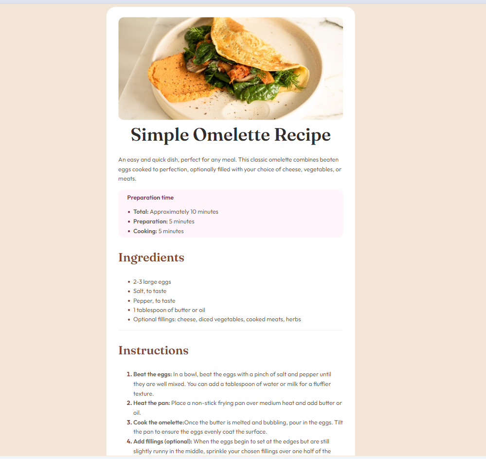
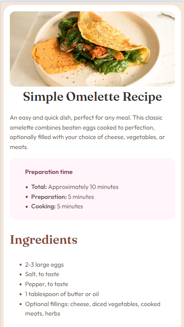

## Welcome! 👋

# Frontend Mentor - Recipe page solution


This is a solution to the [Recipe page challenge on Frontend Mentor](https://www.frontendmentor.io/challenges/recipe-page-KiTsR8QQKm). Frontend Mentor challenges help you improve your coding skills by building realistic projects. 

## Table of contents

- [Overview](#overview)
  - [The challenge](#the-challenge)
  - [Screenshot](#screenshot)
  - [Links](#links)
- [My process](#my-process)
  - [Built with](#built-with)
  - [What I learned](#what-i-learned)
  - [Continued development](#continued-development)
  - [Useful resources](#useful-resources)
- [Author](#author)
- [Acknowledgments](#acknowledgments)


## Overview

### Screenshot



### Links

- Solution URL: [Github](https://github.com/elic4vet/recipe-page-main)
- Live Site URL: [Live demo](https://elic4vet.github.io/recipe-page-main/)

## My process

### Built with
- Semantic HTML5 markup
- CSS custom properties
- Flexbox
- Mobile-first workflow
- [Styled Components](https://styled-components.com/) - For styles

### What I learned

I learned more about the ::marker CSS pseudo-element that selects the marker box of a list item and i learned more about flexbox and the resposiveness.

To see how you can add code snippets, see below:

```html
<h1>Some HTML code I'm proud of</h1>
```
```css
.prep__steps ::marker {
    color: var(--dark-raspberry);
}

.preparation {
    display: flex;
    flex-direction: column;
    background-color: var(--Rose-White);
    border-radius: 15px;
    font-family: var(--second-f-family);
}

section .prepation {
    font-family: var(--second-f-family);
}

.ingredients__list ::marker {
    color: var(--nutmeg);
}

```

### Continued development
I will continue building responsive apps and will make sure to make every app accessible via every device. 

### Useful resources

- [::Marker](https://developer.mozilla.org/en-US/docs/Web/CSS/::marker) - This helped me understand and make use of the CSS pseudo-element called ::marker. I really liked this pattern and will use it going forward.
- [Responsive website](https://kinsta.com/blog/responsive-web-design/) - This is an amazing article can help you understand the basics rules about responsiveness

## Author

- Website - [My portfolio](https://erkekoglou.netlify.app/)
- Frontend Mentor - [@yourusername](https://www.frontendmentor.io/profile/elic4vet)
